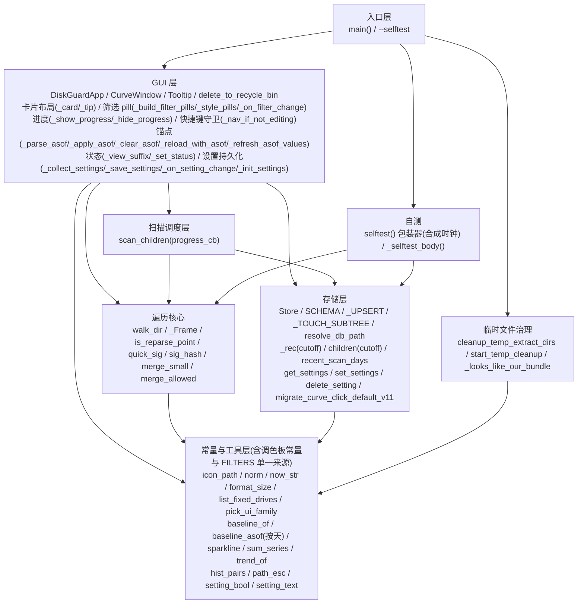
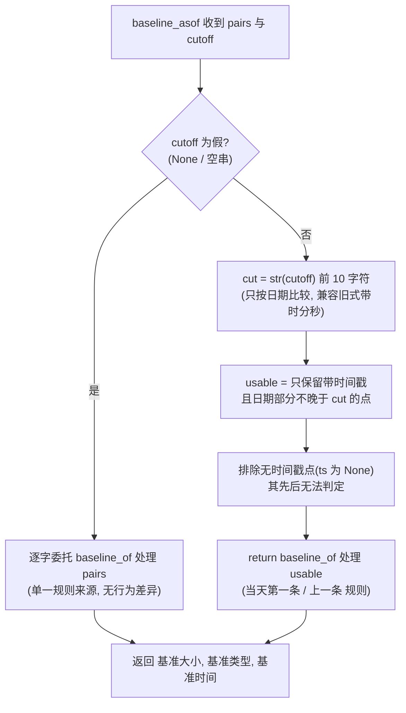
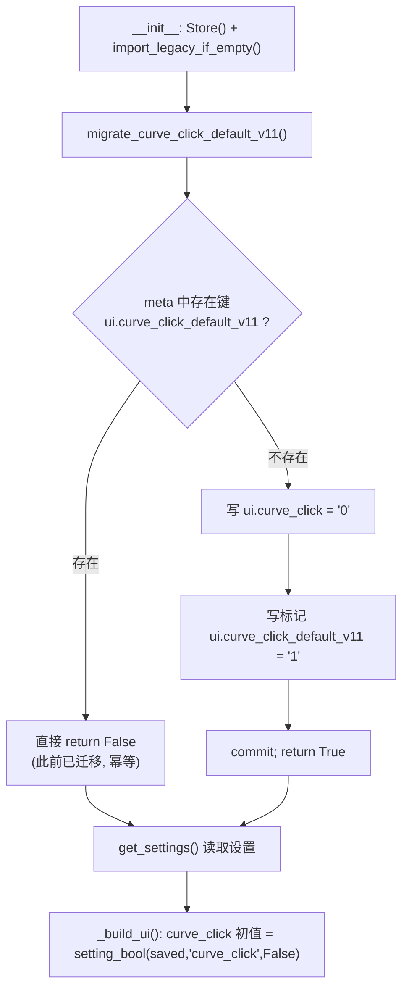

# DiskGuard 架构设计文档

> 本文档面向**希望阅读或修改源码的开发者**；只想使用这个工具的用户请看 `README.md`。
>
> 对象：`disk_guard.py` —— 单文件 Python 3.11 + Tkinter 实现的 Windows 磁盘空间监控小工具，当前发布版本 **1.0.0**。
>
> 本文只描述**现状与设计权衡**，**不依赖具体行号**（行号随代码演进立即过期），请用**函数名 / 类名 + 语义**作索引（见附录 A）。界面截图见 `docs/screenshot-main.png`、`docs/screenshot-minsize.png`、`docs/screenshot-filter-anchor.png`。

---

## 1. 项目概览

| 维度 | 内容 |
|------|------|
| 定位 | Windows 桌面小工具：扫描指定磁盘/文件夹的**一级子目录**大小，与"比较基准"对比，增长超阈值标红预警；支持**比较时间锚点（按天）**、**筛选**（全部 / 仅预警 / 仅星标 / 仅增长 / 仅减少）与**界面设置持久化** |
| 运行语言 / GUI | Python 3.11+（需**带 tkinter**；在 Python 3.11 + Tk 8.6 上开发验证）；Tkinter / ttk（`theme_use("clam")` 优先，回退 `vista`），Canvas 手绘曲线、**卡片式布局**、筛选**分段 pill**、**自写 Tooltip**、自定义**应用图标** |
| 运行时依赖 | **零第三方**（仅标准库：`ctypes datetime hashlib json os queue shutil sqlite3 stat string sys tempfile threading time tkinter concurrent.futures`）。图标生成脚本用 `numpy+Pillow`，**属离线开发工具，不进运行时/打包依赖** |
| 数据存储 | SQLite `diskguard.db`（WAL），表 `folders` / `scans` / `meta`；**界面设置亦落在 `meta` 表**（键统一 `ui.` 前缀，未新增表、未改 schema），另有**一次性迁移标记键**（见 5.9） |
| 打包 / 规模 / 运行形态 | PyInstaller，onefile + windowed，显式捆绑若干原生 DLL，嵌入 `assets/DiskGuard.ico`（缺失仅告警、不致失败）；单文件，**138 个函数与方法 · 6 个 class**；单进程：UI 主线程 + 1 扫描线程 + 1 临时清理线程 + 扫描线程内 `ThreadPoolExecutor`（≤16）worker |
| 自测 | `python disk_guard.py --selftest`，内置断言、**不依赖 pytest**；`selftest()` 打桩合成时钟与真实日期解耦，测试库建于系统临时目录 |
| 权限性质 | 只读磁盘元数据 + 大小统计；唯一写操作在**用户显式确认后**删除到回收站（`SHFileOperationW` + `FOF_ALLOWUNDO`），不提供永久删除 |

**免责说明**：DiskGuard 是**本地工具**——只读文件系统元数据（大小、mtime、目录项），**不读文件内容、不联网、不上传数据**；结果与历史仅写入本机 `diskguard.db`。"删除到回收站"是唯一的数据修改动作，需用户确认且可还原，程序自身**不会永久删除文件**。

---

## 2. 模块分层

单文件内以"注释分节 + 函数/类聚合"实现逻辑分层，依赖方向自上而下（上层调用下层，下层不反向依赖）。



| 层 | 职责 |
|----|------|
| 常量与工具 | 路径规范化、图标路径解析、格式化、配色与阈值常量、筛选档位单一来源 `FILTERS`、基准与趋势纯函数（`baseline_of` / `baseline_asof` / `sparkline` / `trend_of`）、设置值安全解析与回落（`setting_bool` / `setting_text`） |
| 遍历核心 | 手写显式栈后序遍历、重解析点过滤、浅层签名、合并规则、**"是否允许合并"唯一判据** `merge_allowed` |
| 存储层 | SQLite 存取、事务锁、迁移、JSON1 增量历史、按锚定日期算基准、设置持久化（`meta` 表 `ui.` 前缀）、一次性设置迁移 |
| 扫描调度 / 临时治理 | 一级子目录并行扫描、批量落库、`purge_stale`、进度回调；`%TEMP%` 下 `_MEIxxxxx` 残留识别与删除 |
| GUI / 入口 | 界面、事件、视图渲染、曲线窗、回收站删除、锚点切换与重读、设置读写与恢复；`main` / `--selftest` |

**为什么坚持单文件自包含**：零第三方运行时依赖使程序可打成单个免安装 exe，用户无需 Python 环境，单文件也便于分发与审阅。代价是单文件较长、缺少物理模块边界（见 10.2）。

---

## 3. 核心数据结构

### 3.1 表结构 DDL（与源码 `SCHEMA` 一致）

```sql
CREATE TABLE IF NOT EXISTS folders (          -- 一行 = 一个目录（含全盘所有已扫描层级）
  path       TEXT PRIMARY KEY,   -- normcase 绝对路径（Windows 上小写+反斜杠）
  real       TEXT NOT NULL,      -- 原始大小写路径（显示/打开/删除用）
  name       TEXT NOT NULL,      -- 目录名（basename）
  parent     TEXT,               -- normcase 父路径
  size       INTEGER,            -- 最新扫描大小(字节)，NULL=未扫描
  prev_size  INTEGER,            -- 上一次扫描大小（算增长用）
  scanned_at TEXT,               -- 该 size 的时间戳 "YYYY-MM-DD HH:MM:SS"
  sig        TEXT,               -- 浅层签名 MD5（仅被扫描目标的一级子目录）
  denied     INTEGER NOT NULL DEFAULT 0,   -- 1=自身无权限读取
  partial    INTEGER NOT NULL DEFAULT 0,   -- 1=子孙存在无权限项(大小不完整)
  starred    INTEGER NOT NULL DEFAULT 0,   -- 1=星标
  seq        INTEGER NOT NULL DEFAULT 0,   -- 写入时的扫描批次 id（purge_stale 用）
  hist       TEXT                -- 历史 [时间, 大小] JSON 数组，由旧到新，最多 HIST_KEEP 个
);
CREATE INDEX IF NOT EXISTS idx_folders_parent ON folders(parent);

CREATE TABLE IF NOT EXISTS scans (            -- 扫描批次审计
  id INTEGER PRIMARY KEY AUTOINCREMENT,
  path TEXT, started_at TEXT, finished_at TEXT,
  total INTEGER,  -- 本次总大小(字节)
  dirs INTEGER,   -- 一级子目录数
  note TEXT       -- 'done' / 'stopped' ...
);
CREATE INDEX IF NOT EXISTS idx_scans_path ON scans(path);
CREATE TABLE IF NOT EXISTS meta (key TEXT PRIMARY KEY, value TEXT);   -- 键值元数据
```

**主要写入点**：`path`/`real`/`parent`/`size`/`prev_size`/`scanned_at`/`sig`/`denied`/`partial`/`seq`/`hist` 均写入 `_UPSERT`（`prev_size` 由 `ON CONFLICT` 的 `prev_size=folders.size` 自动滚动；`touch` 只追加历史点、不改 `size`/`scanned_at`）；`starred` 由 `set_star`；`scans.*` 由 `begin_scan`/`end_scan` 成对写入；`meta` 存 `legacy_imported`（旧基线导入标记，仅空库时写）与 `ui.*`（界面设置，见 3.4）。

### 3.2 关键内存态 dict

**`scan_children()` 产出与 `Store._rec()` 读库记录**（字段对齐，便于同构渲染；`prev_raw_ts` 仅扫描侧、`hist`/`hist_ts` 仅读库侧）：

```jsonc
{ "name": "Users", "path": "<abs path>", "size": 83999441530,   // int|null 字节
  "ts": "2026-09-21 16:16:50", "sig": "a1b2…", "denied": false, "partial": false,
  "prev": 83994220876, "prev_kind": "当天第一条", "prev_ts": "2026-09-21 16:14:39",
  "starred": true, "cached": false, "merged": false }
```

**GUI 行 dict（`_build_rows()` 产出，供渲染/排序/曲线）**：

```jsonc
{ "name": "Users", "path": "<abs path>", "size": 83999441530,
  "prev": 83994220876, "prev_disp": 83994220876, "prev_kind": "当天第一条",
  "delta": 5220634, "pct": 0.06, "status": "↑ 增长", "ts": "2026-09-21 16:16:50",
  "starred": true, "denied": false, "merged": false, "alert": false, "cached": false,
  "series": [83994220876, 83999441530], "spark": "▃▅",
  "trend_dir": 1, "trend_delta": 5220634 }   // trend_dir: 1=涨 -1=跌 0=平
```

**合并行**（`merge_small()` 产出）：`{"name": "📦 合并的小文件夹(N个)", "path": null, "size": <Σ>, "prev": <Σ>, "merged": true, ...}`。显示前缀由常量 `MERGED_PREFIX` 给出；**旧前缀保留为常量 `LEGACY_MERGED_PREFIX`**，专供"首次运行导入旧版遗留基线文件"时识别历史合并行——`import_legacy_if_empty` 对**新旧两个前缀都跳过**，否则旧库里的合并行会被当成真实目录导入。**请勿误删 `LEGACY_MERGED_PREFIX`。**

**`status` 枚举**：`未扫描` / `⛔ 无权限`(`DENIED_STATUS`) / `⚠ 部分无权限 <base>`(`PARTIAL_HINT`) / `⚠ 预警` / `↑ 增长` / `↓ 减少` / `— 持平` / `新建基线` / `✓ 无变化(缓存)` / `— 合并单位(双击展开)`。

### 3.3 设置键（`meta` 表 `ui.` 前缀）

全部落在既有 `meta(key,value)` 表，`key` 统一 `ui.<name>`，`value` 一律字符串。**未新增表、未改 `SCHEMA`、未触碰 `legacy_imported`**——`get_settings()` 只 `SELECT key,value FROM meta WHERE key LIKE 'ui.%'` 并剥前缀。它读回的是**上次保存的原始字符串 dict**，具体解析在构建界面时进行。布尔项由 `setting_bool`、数值项由 `setting_text`（模块级函数）解析，`filter` 五值判定与 `asof` 解析在构建/渲染处内联，`path`/`drive` 由 `_restore_target` 校验；另有**非用户键** `ui.curve_click_default_v11`（一次性迁移**标记键**），落在 `ui.%` 下会被 `get_settings()` 读进 dict，但**不参与界面构建**（见 5.7）。

| 键（去前缀后） | 语义 | 默认 | 校验 / 回落规则（非法一律回落默认，绝不抛异常） |
|---|---|---|---|
| `drive` / `path` | 启动盘符 / 启动扫描路径 | 系统盘 / 盘符根 | 不在可用盘符内 / `isdir` 为假 → 回落 |
| `mb` / `pct` / `min_mb` / `interval` | 增长阈值（MB / %）/ 小于 N MB 合并显示 / 自动扫描间隔（分钟） | `500` / `10` / `0` / `30` | `float` 可解析，否则默认 |
| `skip` / `drill` / `curve_click` / `auto` | 跳过无变化 / 双击下钻 / 单击弹曲线 / 定时自动扫描 | `0` / `1` / `0` / `0` | 按 `1/0`(含 `true/false`) 解析；`auto` 为真时启动即武装定时器 |
| `filter` | 筛选档位 | `全部` | 必须在 `FILTERS` 五档内，否则回落 `全部` |
| `asof` | 比较时间锚点（**按天**） | `""`（无） | 必须被 `_parse_asof` 解析为 `YYYY-MM-DD`，否则视为无锚点（旧式带时分秒取前 10 字符兼容） |

---

## 4. 关键流程时序

### 4.1 一次扫描（扫描 → 写库 → 重读 → 渲染）

```mermaid
sequenceDiagram
    actor U as 用户
    participant APP as DiskGuardApp(UI主线程)
    participant T as _scan_worker(扫描线程)
    participant SC as scan_children
    participant EX as ThreadPoolExecutor(≤16) / walk_dir
    participant ST as Store(SQLite)
    U->>APP: 点击"开始扫描"(或 F5)
    APP->>APP: start_scan() 校验路径/阈值, 禁用按钮, 清空树, _show_progress()
    APP->>T: Thread(daemon).start()
    T->>ST: begin_scan(target) → scan_id
    T->>SC: scan_children(target, stop_event, store, scan_id, progress, skip)
    SC->>ST: children(target) 先取 prev_map(必须在写库前)
    SC->>SC: os.scandir(target) 收集一级子目录
    loop 每个一级子目录(并行)
        alt 重解析点 / 浅层签名命中(skip 且 sig 一致)
            EX->>ST: emit(path,0) 或 touch(path,scan_id)(复用旧子树, 不遍历)
        else 正常遍历
            EX->>ST: walk_dir 后序 emit → upsert_many(攒 BATCH 条 flush); purge_stale(parents)
        end
        EX->>APP: ui_queue.put(("progress", msg, n, total))  // 非阻塞投递
    end
    SC->>ST: purge_stale([target]) + upsert_row(target 自身行)
    T->>ST: end_scan(scan_id, total, dirs) (或 stopped)
    T->>APP: ui_queue.put(("done", target, results, elapsed))
    APP->>APP: _poll_queue(每100ms) 消费 progress → status + progress_var
    APP->>ST: children(target) 重读权威数据(prev/hist 已由写库更新)
    APP->>APP: _show_records → _build_rows → _redraw_rows; _finish_scan 收起进度
```

> **关键点**：写库在遍历过程中进行（边扫边批量落库，崩溃可恢复）；UI **不直接用扫描线程的返回值渲染**，而是扫描结束后**从库里重读**权威数据（`children(target)`），故 `prev`/`hist` 一定是写库后的最新状态。

### 4.2 双击下钻 + 单击曲线（读库，不重扫）

- **双击普通行** → `history.append(_snapshot())` 存档，再 `store.children(path)` **纯读库**取下一层 → `_show_records(mode="drill")`；**双击合并行** → 用 `merge_small` 取成员平铺显示（`mode="merged"`）。
- **单击行**（`curve_click` 开启时）→ `CurveWindow.show(...)` 单例窗口，`_draw()` 用 Canvas 手绘折线/网格/刻度，`[X]` 只 `withdraw` 隐藏（不 destroy），ESC 同；**返回上一层** → `history.pop()` 恢复快照视图，**不重扫**。

### 4.3 应用比较时间锚点（按天，只锚定比较侧）

```mermaid
sequenceDiagram
    actor U as 用户
    participant APP as DiskGuardApp
    participant ST as Store(SQLite)
    U->>APP: 输入日期 D(或从下拉选历史日期), 点"应用"
    APP->>APP: _apply_asof(): 空/"最新" → 转 _clear_asof()
    APP->>APP: _parse_asof(D) 取前 10 字符按 %Y-%m-%d 校验; 非法返回 None
    alt 解析失败
        APP->>APP: 状态栏提示 "日期无法识别: D (示例 2026-09-23)", 视图不变
    else 解析成功
        APP->>ST: _save_settings() → set_settings({"asof": D, ...}) (INSERT OR REPLACE)
        APP->>APP: history.clear() (栈内 record 按旧锚点算, 必须清空)
        APP->>ST: _reload_with_asof() → children(target, cutoff=D)
        ST-->>ST: SELECT ... WHERE parent=? (当前大小=folders.size, 不变)
        ST-->>ST: _rec(row, cutoff): baseline_asof(pairs, cutoff) 取 ts[:10]<=D; 不回落 prev_size
        APP->>APP: _show_records → _build_rows → _redraw_rows
        Note over APP: 顶部副标题追加 "锚点 D"; 状态栏追加 " | 锚点 D"
    end
```

**按天锚点的"选点"过程（`baseline_asof(pairs, cutoff)`）**：



### 4.4 界面设置持久化（启动恢复 + 变更即存 + 关闭兜底）

| 阶段 | 行为 |
|------|------|
| **启动** | `__init__`：`Store()` + `import_legacy_if_empty()` → **`migrate_curve_click_default_v11()`（必须在 `get_settings()` 之前）** → `get_settings()` 读回 `ui.*` → `_build_ui()` 各 Var 用 `setting_bool`/`setting_text` 取初值（`filter` 走 `FILTERS` 校验、`asof` 走 `_parse_asof`、`path` 走 `_restore_target`）→ `_init_settings()` 对每个 Var `trace_add("write", _on_setting_change)` → 若 `auto=1` 武装定时器 |
| **运行期变更** | Var 变化 → `_on_setting_change()`（构建期 `_loading_settings` 时不触发）→ `after_cancel` 旧 job + `root.after(800, _save_settings)` 防抖 → `_collect_settings()` → `set_settings()` → `INSERT OR REPLACE`；顺带刷新视图与锚点下拉候选 |
| **关闭兜底** | `_on_close()`：`stop_event.set()`、取消 `auto_job`/`_settings_job` → `_save_settings()` 再存一次 → `store.close()` → 清理临时残留并 `destroy` |

---

## 5. 核心算法说明

### 5.1 手写显式栈后序遍历 + 重解析点过滤（`walk_dir` / `_open_frame` / `_Frame`）

- **为什么不用递归**：深目录会触发 Python 递归深度限制；显式栈内存只占"目录深度 × 一帧"。
- **为什么不用 `os.walk`**：`os.walk(topdown=False)` 的剪枝在遇 junction/symlink 时曾失效，导致钻进链接死循环。
- **`_Frame`**：`__slots__` 帧，字段 `path / kids / i / fb(本层文件字节) / sub(已完成子目录合计) / part / denied / err / sig`。
- **后序**：子目录先 `pop` 并 `parent.sub += size`，子帧 `denied||part` 时置父帧 `part=True`，最后 `emit(自身)`；顶层复用 worker 预计算的 `root_sig`，避免重复 `quick_sig`。
- **复用枚举缓存**：`DirEntry.stat(follow_symlinks=False)` 复用 scandir 缓存，不额外系统调用。
- **重解析点过滤**：`st_file_attributes & FILE_ATTRIBUTE_REPARSE_POINT` 直接跳过（防 junction 环）；无属性时回退 `os.path.islink`。
- **异常语义**：`FileNotFoundError`→忽略（扫描中被删）；其它 `OSError`→`fr.denied=True`。

### 5.2 比较基准 `baseline_of` 与 `prev_size` 的"随时可算"

```
baseline_of(pairs):            # pairs=[[ts,size],...] 由旧到新
    len(pairs) < 2 → (None,None,None)                                    无基准
    today = pairs[-1].ts[:10]；若 today:
        在 pairs[:-1] 中找第一个 ts[:10]==today 的点 → (size, "当天第一条", ts)
        找不到                                      → (last_prev.size, "上一条", last_prev.ts)
    旧格式点(ts=None)不参与"当天"判定，只能作"上一条"
```

`prev_size` 的 ON CONFLICT 写法：`prev_size=folders.size, size=excluded.size` → 每次 upsert 把旧 `size` 滚进 `prev_size`。因此**任意视图（扫描结果 / 读库浏览 / 下钻）任何时刻**都能直接读到"上次大小"。读库时 `_rec()` 优先用 `baseline_of(hist)` 取更贴合的基准，取不到才回退 `prev_size` 列（此时 `prev_kind="上一条"`）。

### 5.3 跳过无变化（`quick_sig` / `sig_hash`）与小文件夹合并（`merge_small`）

- **签名**：`[根目录 mtime, 直接子项数] + 排序后的 [name.lower(), mtime, size(非文件=-1), is_dir] 列表`，用 `md5(json.dumps(sig, sort_keys=True))` 存 `folders.sig`。命中判定 `skip_unchanged and sig_h and prev.sig == sig_h and prev.size is not None`；命中后复用 `prev.size/denied/partial` 并 `store.touch(path)` **只追加一个历史点、不遍历**。**已知局限：仅检测直接子项变化，深层修改若未引起中间目录 mtime 变化会漏检。**
- **合并**：`min_mb<=0` 原样返回；`lim = min_mb * 1MiB`；"小" = `size` 非空且 `< lim` 且非 `denied` 且非 `partial`（无权限项大小不可信，不参与）。有则生成合并行（`size=Σ小项, prev=Σ有值小项.prev, merged=True, path=None`）；"近期走势"用 `sum_series`（从最新往回对齐求和，近似无时间戳），双击展开成员。**筛选档位非"全部"时不合并**（见 5.8）。

### 5.4 走势缩略图、曲线与行内 JSON1 增量历史

- **`sparkline`** 取最近 `SPARK_WIDTH` 点按窗口内相对大小映射到 `▁▂▃▄▅▆▇█`（全等 → 统一 `▅`）；**`nice_range`** 纵轴留白 8%（全等时上下各 5%）；**`trend_of`** 取末两点差值 → `(1/-1/0, delta)`；**`CurveWindow._draw`** 横坐标=第几次记录、纵坐标=大小，折线色 涨红/跌绿/平灰，5 条横向网格 + 左轴刻度。
- **`hist` 行内 JSON1**：追加 `json_insert(hist, '$[#]', json_array(ts, size))`（`'$[#]'`=数组末尾）；当 `COALESCE(json_array_length(hist),0) >= HIST_KEEP(24)` 时套 `json_remove(..., '$[0]')` 丢最旧。缓存命中时 `_TOUCH_SUBTREE` 对 `path=? OR path LIKE ?` 命中的**整棵子树**追加 `[ts,size]`（`size IS NULL` 跳过），保证"第 n 次"横向可比；`hist_pairs` 同时接受旧格式纯数字（`ts=None`）与 `[ts,size]` 对。
- **`purge_stale`**：`DELETE FROM folders WHERE parent=? AND seq<>?`。依赖后序保证"子行先落库（seq=本次）"，本次扫描未出现的旧子项（seq=旧值）被清除、本次写过的因 seq 相同而保留；worker 内每 flush 一次调用，`scan_children` 结束再对 target 调一次。
- **`Store._migrate`**：`PRAGMA table_info(folders)` 探列 → 无 `hist` 则 `ALTER TABLE ADD COLUMN hist`，并把已有 `prev_size/size` 回填为首个历史点（`json_array(prev_size, size)` 或 `json_array(size)`，条件 `hist IS NULL AND size IS NOT NULL`）。

### 5.5 按天历史基准 `baseline_asof`（比较时间锚点）

```
baseline_asof(pairs, cutoff=None):
    cutoff 为假(None/"")  → 直接 return baseline_of(pairs)     # 规则只有一份, 杜绝漂移
    cutoff 为真            → cut = str(cutoff)[:10]            # 只按日期比较, 兼容旧式带时分秒
                            usable = [(t,s) for t,s in pairs if t and t[:10] <= cut]
                            return baseline_of(usable)
```

| 要点 | 说明 |
|------|------|
| **单一规则来源** | `cutoff` 缺省时**逐字委托** `baseline_of`，不为"锚点"另写一份"当天第一条/上一条"规则，从结构上杜绝两处实现漂移 |
| **按天归一化** | 内部先取 `str(cutoff)[:10]`，两侧都只比到"日期"；历史版本里保存的带时分秒旧锚点值**仍能照常工作**（等价于其日期） |
| `<=` 包含语义 / 排除无时间戳点 | 过滤 `t[:10] <= cut`，即"锚定日当天**及更早**"，含当天更晚时刻的点；旧格式纯数字点（`ts=None`）**被排除**——其先后无法判定，保留会被错误当作"上一条" |
| **只锚定比较侧** | `baseline_asof` 只决定"基准/基准时间"；`_rec(cutoff)` 中 `size` 仍取 `folders.size`（最新值）。增长语义 = "**从锚定日那一刻的基准 → 涨到现在**"，而非整表回溯快照 |
| **有锚点时禁止回落 `prev_size`** | `_rec` 在 `cutoff` 为真时**不**回落 `prev_size` 列——该列是"上一次扫描"值、与锚定日期无关，回落会给出错误且过新的基准。可用点不足 2 个即 `(None,None,None)`，行显示"新建基线"（正常） |
| 与默认视图等价 / 下拉按天 | `children(base, None)`/`children(base, "")` 与不传 `cutoff` 完全一致；`recent_scan_days(limit=20)` 用 `SELECT DISTINCT substr(finished_at,1,10) ... ORDER BY d DESC` 返回**去重日期**，避免同一天多次扫描在下拉里出现多个实质等价项 |

### 5.6 筛选（5 档）与"小文件夹合并"的交互

**筛选档位单一来源**：模块级常量 `FILTERS = ("全部","仅预警","仅星标","仅增长","仅减少")`。所有校验点（`_build_filter_pills`/`_show_records`/`_view_suffix`/`_refresh_db_info`）与控件候选值都引用它——新增档位只需改这一处，杜绝"控件里能选、逻辑上被判非法"的不一致。

```
flt = filter_var                              # 5 档之一 (非法值回落 "全部")
if merge_allowed(merge, flt):                 # == bool(merge) and flt == "全部"
    display, merged, members = merge_small(records, min_mb)
else:
    display, merged, members = list(records), None, []    # 平铺, 不合并
→ _build_rows(display, merged, members, mb_th, pct_th, flt)
```

**视图不变量 `merge_allowed(merge, flt)`**：`return bool(merge) and flt == "全部"`（唯一判据：只有"全部"档才允许合并）。**为什么非"全部"就不合并**：合并行自身既非预警、也不带星标/增长语义，一旦合并，成员行会从视图移除 → **任何筛选档（含"仅增长"/"仅减少"）下被筛出的成员行都会被"📦 合并的小文件夹"合并行吞掉，用户永远看不到**。**抽成唯一判据的原因**：早期曾把该例外内联写在 `_show_records` 里，后抽出 `merge_allowed()` 作**视图不变量**，避免"新增筛选档时漏改某处"（自测对 5 档 × merge 真/假做了穷举断言）。

各档判定在 `_build_rows` 内、`alert` 计算与 `cached` 强制置位**之后**进行：`仅星标`→`if not starred: continue`；`仅预警`→`if not alert: continue`；`仅增长`/`仅减少`→按 `delta = size - 基准` 的**符号**判定。故"仅预警"看到的是**最终**预警集合（含"✓ 无变化(缓存)"行被强制 `alert=False` 后正确排除），`denied` 行（`alert` 恒 False）也被正确过滤。筛选**不重扫、不重读库**（仅对当前 `_records` 重绘），切换即时。

### 5.7 设置一次性迁移（`migrate_curve_click_default_v11`）

**背景**：`curve_click`（单击行弹出曲线）默认值曾由**开**改为**关**，但老库里已存着 `ui.curve_click = "1"`——**只改代码默认值对老用户无效**（设置存在即被读回），故用带版本号的标记键做一次性迁移。



- **标记键名中的 `_v11` 属于持久化契约，不可为"看起来干净"而重命名**：该键已写入用户既有数据库——一旦改名，旧库将找不到标记而**重跑迁移**，把用户手动改回的 `ui.curve_click` 静默改回 `"0"`，直接违反下面的"永不覆盖用户选择"保证。若确需换名，只能**新增键并双读兼容**，不可原地改名（`ui.curve_click` 是用户设置键，与标记键是**两个不同的键**，勿混）。
- **只执行一次 / 永不覆盖用户选择**：以标记键是否存在为准，存在即 `return False`，**绝不重复写**；用户之后手动改回的 `ui.curve_click`（含改回 `"1"`）不会被再次改写。
- **只动这两个键**：只 `INSERT OR REPLACE` `ui.curve_click` 与标记键，不触碰其它 `ui.*` / `legacy_imported`；**空库 / 新库不报错**，首次调用即完成迁移并落标记，之后幂等。
- **调用时机**：必须在 `__init__` 中 `get_settings()` **之前**，否则界面先把迁移前旧值读回；外层 `try/except sqlite3.Error` 兜底。

---

## 6. 并发模型

后台共两类线程：**扫描线程**（`_scan_worker`，daemon，内部再开 `ThreadPoolExecutor`，`max_workers=min(16,(cpu or 4)*2)`）与**临时清理线程**（daemon）；两者都只通过单向队列 `ui_queue` 向 **UI 主线程**回传消息，UI 不反向调用后台；所有线程写库都经过 `Store` 的**单个 `RLock`**（配单个 sqlite3 连接），UI 在主线程用 `root.after(100,...)` 轮询消费队列。

| 机制 | 说明 |
|------|------|
| 通信方向 / 消息 | `ui_queue` **单向**（后台 → UI）；消息 `("progress",msg,n,total)` / `("done",target,results,elapsed)` / `("stopped",)` / `("error",msg)` / `("cleanup",n,freed)` |
| UI 消费 / 进度条 | `_poll_queue` 用 `root.after(100,...)` 自循环（`queue.Empty` 静默）；进度只在**主线程**读写：`progress_var = min(100, n/total*100)`（仅 `total` 非 0 时），后台仅投递数值 |
| 取消 / 并发 / 锁 | `stop_event`（`threading.Event`）在 worker 入口与 `walk_dir` 循环检查，取消抛 `KeyboardInterrupt` → `end_scan(note="stopped")`；并发上限 `min(16,(cpu or 4)*2)`；单 `RLock` 串行化**所有** SQL，`executemany`+单次 commit 批量写；`check_same_thread=False, timeout=30`，全进程 1 个连接 |
| 定时任务 | `root.after` 驱动（UI 线程），`auto_job` 句柄可取消；间隔 1–1440 分钟 |

**临时解包残留治理**：onefile 程序每次运行解包到 `%TEMP%` 下 `_MEIxxxxx`，进程被强杀时可能残留。程序在启动与退出时以**三重归属判据**识别"自己的"残留（① `.diskguard_mei` 标记文件；② 文件名集合 == 当前解包签名；③ 内容特征 `pythonXYY.dll + _tkinter.pyd + _tcl_data + _tk_data`），再用 `os.rename(..., *.dg-clean)` 试探占用、多次补扫后删除。

---

## 7. 视图层设计

> 面向使用者的快捷键表与配色表见 `README.md` 的「快捷键」「配色与视觉」两章；本章只谈分层/模块/设计权衡。

### 7.1 调色板常量层（低成本换肤机制）

配色集中在文件顶部常量区（品牌主色 `ACCENT=#2563eb`、页面底 `PAGE_BG`、卡片描边 `CARD_BORDER`、预警行 `RED_BG`/`RED_FG`、变大 `GROW_*`、变小 `SHRINK_*`、星标 `STAR_*`、文字 `TEXT`/`TEXT_MUTED` 等，完整色值见 `README.md`），界面各处只引用常量名、**不写字面色值**。**换肤成本低的关键设计**：色值替换**只发生在常量层**，`_redraw_rows` 的行着色 tags 与 `tree.tag_configure(...)` 引用的是**常量名**——因此改色时**行着色逻辑一行未改即自动生效**（"语义命名 + 集中常量"的收益）。

### 7.2 主题选型、按钮语义与行着色优先级

- **`clam` vs `vista`**：`main()` 中 `ttk.Style().theme_use("clam")`，`TclError` 时回退 `vista`。原生 `vista` 会**忽略**对 `TButton`/`Treeview.Heading` 的自定义 `background`/`borderwidth`，导致"换肤不生效"；`clam` 是 Tk 自绘外观，可完整控制配色与扁平化（代价：丢失部分原生观感与动画，属主动取舍）。
- **按钮三档**（`_build_ui()` 内集中定义，新增语义按钮只需挂 `style=`）：`TButton`（默认，普通操作，扁平 + `SURFACE_ALT` 底）、`Accent.TButton`（主操作「开始扫描」，实心蓝底白字）、`Danger.TButton`（危险操作「删除到回收站」，红字、悬停浅红底）。
- **行着色优先级**：`Treeview.tag_configure` 预置 6 个 tag，`_redraw_rows` 对每行**按优先级择一**（单值 tag，不做叠加）：`alert(预警) > grow(变大·红) > shrink(变小·绿) > star(星标·黄) > stripe(偶数行斑马纹) / ok(默认)`。单值选择避免"星标 + 变大"时两个背景色互相覆盖、结果不确定；语义色沿用中国习惯（红=涨/预警，绿=跌）。

### 7.3 扫描进度条的数据通路与估算性质

进度条 `ttk.Progressbar(mode="determinate")` 创建时**不 `pack`**，`_show_progress()` 在扫描开始时挂载到页面中部，`_finish_scan` 置满后延迟 `_hide_progress()` 收起。计数口径：`n` = 已完成的一级子目录数，`total` = 一级子目录总数；`scan_children` 的 `progress_cb` 默认 `None`（不传回调时完全不涉及进度）。**估算性质**：单个超大目录遍历耗时长时会**停在该格不动**（total 不推进），属正常；勾选「跳过无变化」时缓存命中的目录也计入 `n`，二次扫描不会卡住。`_hide_progress` 内含"扫描线程仍存活则不收起"，防止上一次扫描的延迟收起误伤本次。

### 7.4 快捷键、焦点守卫与视图可见性约定

- **快捷键与守卫**：`F5`→`start_scan`；`退格`→`go_up`；`Ctrl+S`→`toggle_star`；`Del`→`delete_selected`（后三者经 `_nav_if_not_editing(action)` 守卫）。**守卫的必要性**：`bind_all` 是**全局**绑定，会劫持输入框按键——不拦截则用户在「扫描路径」框内按退格会触发"返回上一层"、在阈值 `Spinbox` 里按 Del 会弹删除确认。故当 `root.focus_get()` 是输入类控件（`Entry`/`Spinbox`）时直接 `return`，只放行 `F5`（不用于文本编辑）。
- **视图可见性约定**：**锚点与筛选必须始终可见**，避免用户误以为看的是默认视图。状态栏把 `_status_base` 与 `_view_suffix()`（追加 `| 锚点 <D>` / `| 筛选: <档>`）分离，`_set_status(text=None)` 统一以 `(base)+(suffix)` 拼装，任何写状态栏的地方都走它，保证后缀**不会漏拼**；顶部副标题（`_refresh_db_info()`）把 `数据库 <path> (<mb> MB, <n> 条记录)`、`锚点 <D>`、`筛选 <档>`、清理提示等 `parts` 用 `"|"` 连成**一行**，详细说明挪到该 Label 的 **tooltip**。

### 7.5 筛选 pill、锚点控件、卡片式布局与自写 Tooltip

- **筛选**：5 个互斥**分段胶囊**（`tk.Radiobutton(indicatoron=False)` 共享 `filter_var` 实现互斥），取值即 `FILTERS` 五档；每项 `command=_on_filter_change` → 先重着色、再 `_refresh_view()` **只重绘当前视图**（不重扫/不重读库）。**用经典 `tk.Radiobutton` 而非 `ttk.Radiobutton`**：前者 `indicatoron=False` 可完全自绘成"实心胶囊"（Tk 无圆角，用实心填充 + 无边框近似）。
- **锚点控件**：可编辑 `ttk.Combobox`（`state="normal"`），默认 `最新`，候选 = `["最新"] + recent_scan_days()`（**按天去重的日期**），允许手工输入；标签 `比较时间锚点(按天)`，右侧 `应用`/`回到最新` 两按钮，详细说明经 tooltip 给出；`_finish_scan` → `_refresh_asof_values()` 刷新候选。**注意 `ttk.Combobox` 没有 `command` 选项，必须 `bind("<<ComboboxSelected>>", ...)`**（见第 9 章约束 13）。
- **卡片式布局**：页面底 `PAGE_BG` + 白卡 `SURFACE` + `CARD_BORDER` 1px 描边形成层次。**Tk 无圆角/阴影**，只能靠"浅灰底 + 白卡 + 1px 细描边"分层，描边用 `tk.Frame(highlightbackground=CARD_BORDER, highlightthickness=1)`（`_card`），无需第三方库。自上而下四张卡：「扫描目标」→「视图」（返回/星标/删除 + 筛选 pill + 合并/跳过 + 锚点）→「预警与定时」→ 树表卡片（`fill=both, expand=True` 占满剩余空间）。
- **自写 `Tooltip`**：被精简掉的说明挪到 tooltip；Tk 无 tooltip、引入第三方库又违反"零运行时依赖"，故自绘：无边框 `Toplevel` + `Label`，`<Enter>` 延迟显示、`<Leave>`/`<ButtonPress>`/`<Destroy>` 收起，随控件销毁一并收起，避免残留浮层挡界面。
- **表头缩短，列 key 不变**：`cols` 的 key 元组（`star/name/size/prev/prevtime/delta/pct/trend/status/scantime`）**保持不变**，仅缩短 `headers` 显示文案（`prev`→"基准"、`prevtime`→"基准日期"、`delta`→"变化"）——因此 `_sort_by(col)` 与 `key_map` 不受影响（"表头文案与列 key 解耦"的收益）。冗长提示也收敛为短标签 + tooltip。

---

## 8. 构建与打包

### 8.1 命令、脚本与原生 DLL

```bat
python build_exe.py            :: 一键打包(windowed onefile)
python build_with_conda.py --distpath dist_diag DiskGuardDiag.spec :: 打包诊断版(带控制台)
python disk_guard.py --selftest :: 跑自测(不弹窗, 纯断言)
python disk_guard.py            :: 直接运行源码(开发)
```

> 需使用**带 tkinter 的 Python 3.11+**（例如安装了 Tk 的 CPython 或 conda 环境）。

| 脚本 | 职责 |
|------|------|
| `build_exe.py` | 一键打包：`os.replace` 把旧 exe 改名让路 → 组装 PyInstaller 参数（含显式 `--add-binary` 与 `--icon assets/DiskGuard.ico`）→ 调 `build_with_conda.py` → 写 `build_log.txt` → 校验 exe 体积 → **自动跑一次冻结态自测**（`<exe> --selftest`，**只看退出码**、失败**只告警不中断**，cwd 设在系统临时目录以免把 `diskguard.db` 写进仓库）。**图标缺失时只告警并跳过 `--icon`，绝不让打包失败** |
| `build_with_conda.py` | PyInstaller 驱动包装：monkeypatch `importlib.metadata.distribution`，对 `enum34/typing/pathlib` 抛 `PackageNotFoundError`，屏蔽 conda 环境残留 obsolete backport 检测 |
| `DiskGuardDiag.spec` | 诊断规格（`console=True`，抓 stderr，不含图标）；**与 `build_exe.py` 共用同一份原生 DLL 收集规则**（同一个 `DLLS` 常量与同一个 `resolve_conda_lib()` 解析函数）——此前两处各维护一份、诊断版漏收 DLL，产出**运行即崩**的 exe（`ImportError: DLL load failed while importing _ctypes`），故合并为单一来源。构建：`python build_with_conda.py --distpath dist_diag DiskGuardDiag.spec`；**必须经 `build_with_conda.py` 驱动**（`python -m PyInstaller` 在 conda 下会被 site-packages 残留的 obsolete backport 卡住）；`--distpath dist_diag` 必需，因 spec 本身无法指定输出目录（默认落到 `dist/`）。onefile 发布规格（`console=False`，`icon=` 指向图标）由 `build_exe.py` 在打包时生成 |
| `tools/make_icon.py` | 离线生成图标（多帧，依赖 `numpy+Pillow`，**仅开发用、不进打包**）；界面冒烟/截图脚本属本地验证用，不随仓库提供 |

打包时**显式列出**以下原生 DLL（来自 Python 环境的 `Library\bin` 一类目录）：`ffi.dll`（ctypes/cffi 底层）、`LIBBZ2.dll` / `liblzma.dll`（bz2 / lzma）、`libcrypto-1_1-x64.dll` / `libssl-1_1-x64.dll`（OpenSSL crypto / ssl）、`sqlite3.dll`（sqlite3 扩展模块）、`tcl86t.dll` / `tk86t.dll`（Tcl / Tk 运行时）。PyInstaller 仅靠 PATH 搜索不可靠，曾出现漏收导致 `ImportError: DLL load failed while importing _ctypes`。用 conda 环境打包时这些 DLL 位于环境的 `Library\bin`，需显式收集；不同 Python 发行版路径与文件名可能不同。

### 8.2 产物清单

`dist/DiskGuard.exe`（发布主程序，onefile+windowed，约 12 MB）；`dist_diag/DiskGuardDiag.exe`（控制台诊断版）；`assets/DiskGuard.ico` / `assets/icon_*.png`（多帧图标与预览/检查图）；`build/` 与打包日志（日志末尾含 `Copying icon to EXE` 可证图标已接线）；若从旧版本升级，目录内可能遗留旧基线文件（首次运行导入后即弃用）；`tools/make_icon.py`（开发工具）。

### 8.3 发布前验证清单

- [ ] `--selftest` 全绿，且**在任意一天都通过**（`selftest()` 把 `now_str` 打桩为相对合成时钟，与真实日期/跨零点无关，含"日期撞车日"）
- [ ] `dist/DiskGuard.exe` 双击可启动、有界面、能扫描并写库；用 `DiskGuardDiag.exe` 复核 stderr 无异常；exe 体积在预期区间（缺 DLL 会显著偏小）
- [ ] **冻结态自测已由 `build_exe.py` 自动执行**（`<exe> --selftest`，cwd 设在临时目录、只看退出码）：本清单长期写着「exe 体积在预期区间（缺 DLL 会显著偏小）」，却**从未有人据此真的跑过诊断版**——实测诊断版 **8.24 MB**、发布版 **12.37 MB**，正是"显著偏小"，实跑后才暴露 `ImportError: DLL load failed while importing _ctypes`。教训：**判据（尤其体积这类启发式判据）必须自动化执行，否则等于不存在**。
- [ ] **图标冒烟**：窗口/任务栏显示图标，日志末尾有 `Copying icon to EXE`
- [ ] **锚点冒烟（按天）**：应用历史日期后，状态栏出现 `| 锚点 <D>`、副标题出现 `锚点 <D>`；「当前大小」列不变、「基准」列变为锚定日及更早值；下拉候选为去重日期
- [ ] **筛选冒烟**：切到「仅预警」「仅增长」「仅减少」后小文件夹合并被关闭（目标行逐行可见），切回「全部」恢复合并；冒烟前先把旧 exe 改名让路（否则覆盖可能被沙箱 safe-delete 拦截 → 假阳性），并确认 `%TEMP%` 无遗留 `_MEIxxxxx`

### 8.4 应用图标

图标不是功能依赖，整条链路都做**优雅降级**（缺图标只告警、不致失败）：`tools/make_icon.py` 全几何绘制（圆角底 → 齿轮环 → 金属渐变字母 "D" → 主色蓝刻度弧），超采样后降采样，输出多帧 `.ico`（用 **BMP/DIB 帧**而非 PNG 压缩帧，PyInstaller 内嵌最稳）；`icon_path()` 返回 `<程序目录>/assets/DiskGuard.ico`（走 `app_dir()`，冻结时取 exe 同目录，因 onefile 解包临时目录里没有 `assets`）；`main()` 仅当文件存在时 `root.iconbitmap(default=ip)`，`except (tk.TclError, OSError, AttributeError)` **静默降级**；`build_exe.py`/`.spec` 存在图标时追加 `--icon`，否则告警跳过。**小尺寸简化底图**：小于 48px 的帧去掉齿轮/螺栓并**放大字形**、加粗蓝弧——细描边降采样后会糊成噪点、反而干扰识别。

---

## 9. 关键约束与已知坑

以下均为**通用工程教训**（与具体机器无关）。

| # | 现象 | 根因 | 对策 |
|---|------|------|------|
| 1 | 打包后启动 `ImportError: DLL load failed while importing _ctypes` | PyInstaller 仅靠 PATH 搜不到 conda 环境的原生 DLL | 打包脚本显式 `--add-binary` 逐个列出，不依赖 PATH |
| 2 | 扫描遇 junction/symlink 钻进链接死循环 | `os.walk(topdown=False)` 剪枝在遇重解析点时会失效 | 手写显式栈后序遍历 + `FILE_ATTRIBUTE_REPARSE_POINT` 过滤 |
| 3 | 重新打包覆盖已存在 exe 被拦截，冒烟测试假阳性 | 沙箱/权限对已存在文件的 safe-delete 限制 | 构建前 `os.replace` 旧 exe 让路 |
| 4 | windowed exe 里 Tk 回调异常"静默消失" | `--windowed` 无控制台，异常只进 stderr 不可见 | 关键回调 `try/except` + `messagebox` 兜底；另提供 `console=True` 诊断版抓 stderr |
| 5 | onefile 运行后数据写进 `_MEIxxxxx` 被清掉 | onefile 每次解包到临时目录，`__file__` 指向该目录 | `app_dir()` 冻结时取可执行文件目录；`resolve_db_path` 优先 exe 同目录，不可写回退用户目录 |
| 6 | 强杀/崩溃后 `%TEMP%` 残留 `_MEIxxxxx` | 进程被强杀时解包目录未清理；DLL 有 delete-pending 延迟 | 三重归属判据识别 + `os.rename` 试探占用 + 多次补扫 + 退出再扫 |
| 7 | 曲线窗再点其它行报 `TclError: bad window path name` | 用户关掉 [X] 后窗口被 destroy，`deiconify` 失效 | `WM_DELETE_WINDOW` 只 `withdraw`；`winfo_exists()` 检测被销毁则重建 |
| 8 | 走势缩略图显示成方框 | 默认字体缺 `▁▂▃…`(U+2581-2588) 与 `★` 字形 | `pick_ui_family()` 回退到含这些字形的中文字体 |
| 9 | 打包环境 PyInstaller 报 obsolete backport | 环境 site-packages 残留 `enum34/typing/pathlib` | monkeypatch `importlib.metadata.distribution` 屏蔽检测 |
| 10 | 缓存加速会漏掉深层变化 | `quick_sig` 仅看直接子项 | 属已知取舍；需要精确时关闭"跳过无变化文件夹"开关 |
| 11 | 自测在"真实日期撞上 mock 日期"当天必失败 | 跨天段落写死绝对日期作模拟"第二天"，真实记录与模拟日同天破坏"当天第一条"规则 | 改用**相对日期**拼装 + 对 `now_str` **单点打桩**，使全部记录落在同一合成日 |
| 12 | 自定义按钮/表头颜色"换肤不生效" | 原生 `vista` 主题**忽略**对 `TButton`/`Treeview.Heading` 的 `background` 等配置 | 改用 `theme_use("clam")` 并回退 `vista`；构建界面时显式 `style.configure`/`style.map` |
| 13 | 给 `ttk.Combobox` 写 `command=fn` 会在构建界面时抛 `TclError` | `ttk.Combobox` **没有** `command` 选项；下拉选中是虚拟事件 | 创建后用 `bind("<<ComboboxSelected>>", handler)` 挂回调 |
| 14 | 切到"仅预警"后，小文件夹里的预警行仍看不到 | 只给单个筛选档加了合并例外、漏了其它档：合并行自身非预警，且合并会把成员行从视图移除 | 只要筛选非"全部"就禁用合并（`merge_allowed`）；**不要**只按单个档位列例外 |
| 15 | 切换比较时间锚点后，返回上一层显示错误锚点下的旧数据 | 历史栈里存的是**按旧锚点算好**的 record dict | 切换锚点前 `history.clear()`（锚点变了，整个历史栈随之失效） |
| 16 | 状态栏在偏矮窗口下被上方卡片挤成**0 高**（"消失"） | `pack` 按**调用顺序**分配空间：状态栏若最后 `pack`，上方卡片用尽高度后它分不到 | **状态栏必须先于卡片 `pack`**（`side="bottom"`），Tk 先占底部，上方卡片再在剩余空间里排 |
| 17 | 切换锚点后「基准」列取了比预期更晚的点 | 按天锚点只精确到**天**：日期 `<=` 锚定日的更晚时刻点也会被纳入 | 属**刻意行为变更**；`baseline_asof` 统一 `cutoff[:10]` 归一化。旧式带时分秒的锚点值仍兼容（等价其日期） |
| 18 | 窗口高度不足时树表被"压没"（0 高） | 上方卡片 + 状态栏占满高度后，`fill=both, expand=True` 的树表无可分配空间 | 抬高窗口高度下限；宽度下限也保证列合计不裁切 |
| 19 | 小尺寸图标（16/24/32px）细节糊成噪点、识别度反降 | 齿轮/螺栓/细描边在降采样到 <48px 后互相混叠 | `make_icon.py` 对 `< 48px` 的帧改用**简化版底图** |
| 20 | 截图区域错位 / 被裁切（**验证脚本的坑，非产品代码**） | 高 DPI 缩放下，Tk 用**逻辑像素**而截图库用**物理像素**，坐标系不一致 | 创建 Tk **之前**先声明 DPI 感知（`SetProcessDpiAwareness`，失败回退 `SetProcessDPIAware`）；产品代码不涉及 |
| 21 | 老库升级后"单击行弹曲线"仍为开（默认值改动不生效） | 只改代码默认值对已有 `ui.curve_click` 的老库无效（设置存在即被读回） | 一次性迁移 `migrate_curve_click_default_v11()`，**必须放在 `get_settings()` 之前**；以版本标记键保证幂等、不覆盖用户后续选择（见 5.7） |

---

## 10. 架构评价

### 10.1 优点

1. **零运行时依赖 + 单文件**：纯标准库、无 pip 依赖，onefile exe 免安装免环境；**读库不重扫**（`prev_size` 滚存 + `hist` 行内 JSON + 完整子层级落库），重启后可直接浏览/下钻，"数据即视图"。
2. **崩溃可恢复 + 遍历稳健**：边遍历边批量落库（`BATCH` 条一批），中断/停止时已扫部分仍在库中，`scans` 表可审计；手写显式栈规避递归深度与 junction 死循环，复用 scandir 缓存减少系统调用。
3. **权限语义清晰 + 内置自测**：`denied`（自身）+ `partial`（子孙）双标记并向上传播，不做系统目录预判；`--selftest` 覆盖扫描/写库/基准/签名/无权限/合并/星标/子树删库/回收站/临时清理及锚点/持久化/迁移等，无 pytest 依赖；状态栏与 `info()` 提供用时、写库耗时、行数与 DB 体积。
4. **换肤/自测成本低**：配色集中于顶部常量区且引用常量名，改色**零逻辑改动**；`now_str` 单点打桩使回归不受"日期撞车/跨零点"干扰。
5. **设置零迁移持久化 + 迁移幂等**：设置复用 `meta` 表（`ui.` 前缀），未新增表、未改 schema，恢复值全部经安全解析回落；默认值改动用**版本标记键**一次性迁移，只动两个键、不覆盖用户后续选择、空库安全。
6. **"规则只有一份"的锚点实现**：`baseline_asof` 无锚点时**直接委托** `baseline_of`，从结构上杜绝两处实现漂移；锚点**只作用于比较侧**，当前大小语义不变。
7. **"视图不变量"抽函数 + UI 零依赖卡片化**：把"只有'全部'档才合并"抽成 `merge_allowed()` 并穷举断言；卡片 1px 描边与 tooltip 均未引入第三方库，表头文案与列 key 解耦，图标生成工具只进开发侧。

### 10.2 技术债与风险

| 级别 | 问题 | 影响 |
|------|------|------|
| 高 | **单文件、无模块划分** | 阅读/维护/协作成本高，缺乏单元边界 |
| 高 | `PRAGMA synchronous=OFF`（配合 WAL） | 掉电/强杀可能丢失或损坏最近写入 |
| 中 | 索引仅覆盖精确 `parent=?`，子树操作的 `path LIKE 'prefix%'` **无可用索引**；`hist` 行内 JSON 数组 | 大库下子树操作与缓存 touch 变慢；`hist` 撑大 DB 且更新是整行改写，无独立历史表 |
| 中 | `quick_sig` 漏检深层变化；无元数据/MFT 级加速，`walk_dir` 逐目录 `scandir` | "跳过无变化"可能漏算，需人工关闭开关复核；全盘扫描耗时随数据量增长（十万级目录记录下查询仍为**亚秒级**，瓶颈在遍历而非查询） |
| 中 | tkinter 线程模型限制：Tk 只能在主线程操作 | 后台只能经 `ui_queue` 回传，逻辑分散；异常静默风险需处处兜底 |
| 中 | **设置与数据库同生命周期**：设置存于 `diskguard.db` 的 `meta` 表 | 删库会**连带丢失全部界面设置** |
| 中 | **锚点视图下"预警"语义变化** | 默认视图"预警"= 相对当天第一条/上一条；锚点视图下变成"从**锚定日**到现在的涨幅"，**同一行在两视图可能一个预警一个不预警**，存在误读风险 |
| 低 | 进度条为**估算进度**（超大目录会**停格**易被误读为"卡死"）；行着色 tag 名与配色**强耦合**（新增状态色需同步改常量、`tag_configure`、`_redraw_rows` 三处，遗漏则静默不生效） | 见左 |
| 低 | `selftest()` 以**替换模块全局 `now_str`** 打桩时钟（**侵入式**手法，新增绕过 `now_str` 的取时路径会失效）；**按天锚点丧失"时刻级"回溯**；**迁移标记键随版本累积** | 每种情况均无统一兜底/清理机制 |
| 低 | `_reload_with_asof` 一律回到一级子目录视图；防抖保存窗口内强制结束进程会丢最后一次变更；状态栏靠字符串拼接维护 | 切换锚点丢上下文；非正常关闭路径最后一次改动未落库；新增视图维度易漏拼，无结构化视图状态对象 |

### 10.3 演进建议

1. **分模块**：拆为 `store/`（存储）、`walker/`（遍历）、`scan/`（调度）、`ui/`（GUI）、`utils/`（工具与趋势）、`build/`（打包），保留 `disk_guard.py` 作为薄入口。
2. **历史外置**：把 `hist` 迁到独立 `folder_history(path, ts, size)` 表 + 索引，降低行宽与写放大，便于查询/导出。
3. **索引补齐**：为子树操作引入可索引的层级方案（`parent` 链 + 深度列，或物化路径），替代 `LIKE 'prefix%'`。
4. **增量扫描**：把 `quick_sig` 升级为可选的"逐层签名 + 根 mtime 短路"，或接入 `ReadDirectoryChangesW` 监听变化；进阶可用 `$MFT` / `FSCTL_ENUM_USN_DATA` 做秒级全盘统计。
5. **可靠性**：改为 `synchronous=NORMAL`（WAL 下仍较快），或"重要写入前 checkpoint"，降低掉电丢数据风险。
6. **导出报表**：支持把当前视图/批次导出 CSV/HTML，便于留档与分享。
7. **设置外置**：把设置从 `meta` 迁到独立用户配置文件（如 `%APPDATA%\DiskGuard\settings.json`），实现"删库不丢设置"。
8. **视图状态对象化**：把"锚点 + 筛选"收敛为一个状态对象，状态栏/说明行由它统一渲染，替代字符串拼接；并在"变化率"列头或预警行加显式"（相对锚定日）"标注。
9. **迁移机制外置**：把多个一次性迁移收敛为 `_migrations = [(标记键, 迁移函数), ...]` 按序执行，降低"忘了放在 `get_settings()` 之前"这类顺序风险。
10. **UI 视觉常量集中**：把卡片间距/列宽等视觉量提到顶部常量区（与调色板并列），使纯视觉微调不再散落在 `_build_ui()` 内。

---

## 附录 A：`disk_guard.py` 符号索引（按源码分节顺序）

| 分节 | 符号 |
|------|------|
| 路径与常量 | `app_dir` `APP_DIR` `LEGACY_BASELINE` `icon_path`；调色板常量 `ACCENT` `ACCENT_DARK` `ACCENT_LIGHT` `SURFACE` `SURFACE_ALT` `BORDER` `TEXT` `TEXT_MUTED` `RED_BG` `RED_FG` `GROW_BG` `GROW_FG` `SHRINK_BG` `SHRINK_FG` `FLAT_BG` `FLAT_FG` `STAR_BG` `STAR_FG` `OK_BG` `STRIPED_BG` `PAGE_BG` `CARD_BORDER`；`MERGED_PREFIX` `LEGACY_MERGED_PREFIX` `DENIED_STATUS` `PARTIAL_HINT` `FILTERS` `BATCH` `HIST_KEEP` `SPARK_CHARS` `SPARK_WIDTH` |
| 临时文件清理 | `MEI_MARKER` `_dir_size` `_payload_signature` `_looks_like_our_bundle` `_rmtree_force` `_mark_own_payload` `cleanup_temp_extract_dirs` `start_temp_cleanup` `norm` `now_str` |
| 目录遍历核心 | `is_reparse_point` `_Frame` `_open_frame` `walk_dir` `quick_sig` `sig_hash` `merge_small` `merge_allowed` |
| 大小趋势 | `hist_pairs` `hist_sizes` `parse_hist` `baseline_of` `baseline_asof`（按天）`sparkline` `sum_series` `nice_range` `trend_of` |
| SQLite 存储 | `SCHEMA` `_UPSERT` `_TOUCH_SUBTREE` `path_esc` `upsert_row` `resolve_db_path` `Store`（`_migrate` `close` `begin_scan` `end_scan` `last_scan` `recent_scan_days` `upsert_many` `purge_stale` `touch` `_rec(cutoff)` `children(cutoff)` `starred_children` `is_starred` `set_star` `remove_subtree` `info` `get_settings` `set_settings` `delete_setting` `migrate_curve_click_default_v11` `import_legacy_if_empty`） |
| 扫描调度 / 回收站删除 | `scan_children` `format_size` `list_fixed_drives` `pick_ui_family`；`_SHFILEOPSTRUCTW` `FO_DELETE` `FOF_*` `delete_to_recycle_bin` `confirm_delete` |
| GUI 辅助组件 | `Tooltip`（class；`_schedule` `_cancel` `_show` `_hide`）、`CurveWindow`（`_build_window` `_alive` `show` `_drop_topmost` `_place_near_master` `_draw`）；`setting_bool` `setting_text`（模块级函数，位于 `Store` 之后、`DiskGuardApp` 之前；设置值的安全解析与回落） |
| GUI | `DiskGuardApp`（建界面/渲染/导航/星标/删除/定时/关闭等方法）——卡片布局 `_card` `_tip`；筛选 pill `_build_filter_pills` `_style_pills` `_on_filter_change`；进度与快捷键 `_show_progress` `_hide_progress` `_nav_if_not_editing`；锚点（按天）`_parse_asof` `_apply_asof` `_clear_asof` `_reload_with_asof` `_refresh_asof_values`；筛选/状态 `_view_suffix` `_set_status`；设置持久化 `_restore_target` `_collect_settings` `_save_settings` `_on_setting_change` `_init_settings` |
| 自测/入口 | `selftest`（包装器，打桩合成时钟）`_selftest_body`（断言体）`main` |
