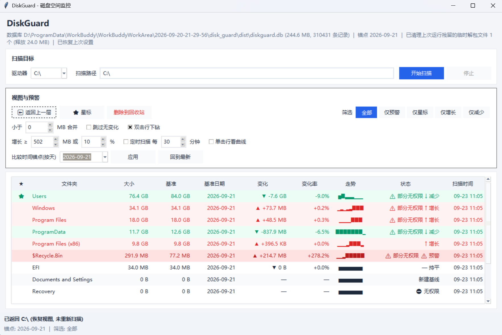

# DiskGuard

是谁吃掉了你的C盘空间🤔

Windows 磁盘空间监控工具：看谁在变大、涨了多少、什么时候开始涨的。




*主界面：顶部为扫描目标卡片，中部为一级子目录的树表，底部为状态栏。更多界面见 [`docs/`](docs/)。*

---

## 它解决什么问题

Windows 自带的"存储感知"只能告诉你**现在谁最大**，回答不了日常清理中最关键的两个问题：

1. **谁在偷偷变大？** —— 缓存目录、日志、构建产物、聊天软件的接收文件目录，增长往往是缓慢的，等磁盘满了才发现。
2. **这次变大的量算不算异常？** —— 需要一个稳定的"比较基准"，而不是每次靠自己记。

DiskGuard 的做法是：**把每次扫描的结果持久化到 SQLite**，于是"当前大小 / 比较基准 / 增长率 / 历史走势"在任何时刻、任何视图（含重启后）都能立刻算出来；双击下钻直接读库、**不需要重新扫盘**。

> 本工具只读取文件系统的元数据（目录枚举 + 文件大小），不做任何"智能清理"；删除动作必须由用户逐项确认，且走回收站。

---

## 功能特性

| 功能 | 说明 |
|---|---|
| 一级子目录扫描 | 并行扫描任意盘符或文件夹，展示其下一级子目录的体积排名 |
| 双条件预警 | 增长 ≥ 指定 MB **或** ≥ 指定百分比即标红，阈值可现场调整 |
| 当天基准 | 基准 = 当天第一条记录；当天此前无记录时用上一条记录（跨天自动回退） |
| 持久化历史 | 每个文件夹保留最近 24 次扫描的 `[时间, 大小]` 历史点，写入 SQLite |
| 走势缩略图 | 列表内用 `▁▂▃▄▅▆▇█` 字符按相对高度画出最近 8 次走势 |
| 变化曲线窗 | 单击行弹出 Canvas 手绘折线窗（红=变大 / 绿=变小），标注每个点的具体大小与时间（默认关闭，可在界面开启） |
| 红绿行着色 | 预警(深红) > 变大(红) > 变小(绿) > 星标(黄) > 斑马纹，优先级从高到低 |
| 卡片式浅色界面 | 浅灰页面底 + 白色卡片分层，扁平按钮，主/危按钮分色；筛选为分段胶囊按钮，选中态一眼可辨 |
| 标签精简 + 悬停提示 | 界面上只留短标签，完整解释移到悬停提示（自写 `Tooltip`，无第三方依赖） |
| 应用图标 | `assets/DiskGuard.ico` 多尺寸图标（16→256 共 7 帧），打包时嵌入 exe，源码运行也作窗口图标 |
| 扫描进度条 | 扫描期间实时显示百分比进度；缓存命中的目录同样计入进度，不会卡住不动 |
| 键盘快捷键 | `F5` 重扫 · `退格` 返回上一层 · `Ctrl+S` 星标 · `Del` 删除（编辑框聚焦时自动屏蔽） |
| 读库下钻 | 双击行直接读数据库展示下一层，不重新扫盘；返回上一层走历史栈，也不重扫 |
| 小文件夹合并 | 小于阈值 MB 的目录合并成一行"📦 合并的小文件夹"，双击可展开明细 |
| 无权限可见化 | 无权限目录标 `⛔ 无权限`，其上级标 `⚠ 部分无权限`（大小可能不完整） |
| 快速增量扫描 | 勾选"跳过无变化文件夹"后，以浅层签名哈希命中缓存，二次扫描可快一个数量级 |
| 星标 | 标记重点目录，可用筛选只看星标，重扫后星标保留 |
| 比较时间锚点（按天） | 指定一个历史日期后，比较基准只取该日（含当天）及更早的记录，用于回答"从那天到现在涨了多少"；当前大小仍是最新值 |
| 筛选五档 | 分段胶囊按钮：全部 / 仅预警 / 仅星标 / 仅增长 / 仅减少 |
| 设置持久化 | 界面上的勾选与填写项自动存入数据库，下次启动原样恢复 |
| 删除到回收站 | 调用系统 `SHFileOperationW` + `FOF_ALLOWUNDO`，可从回收站还原；拒绝删除盘根 |
| 定时自动扫描 | 按分钟间隔自动重扫，用于长期盯守某个目录 |
| 临时残留自清理 | 自动清理自身历次运行在 `%TEMP%` 遗留的解包目录 |

---

## 快速开始

### 环境要求

| 项 | 要求 |
|---|---|
| 操作系统 | Windows（依赖 `ctypes.windll` 与 `st.file_attributes`） |
| 运行（源码） | Python 3.11 及以上，且需含 `tkinter` / Tk 8.6 |
| 第三方依赖 | **零运行时依赖**，无需 `pip install` 任何包 |

### 运行

```bat
python disk_guard.py
```

> 用你自己的 Python 即可（例如 `python` 或 `py -3.11`）。若提示找不到 `tkinter`，
> 说明当前解释器未编译该模块，请换一个带 Tk 的 Python 发行版。

也可以直接使用 [Releases](../../releases) 中提供的 `DiskGuard.exe`，免安装、无需 Python 环境。

### 首次使用

1. 在「扫描目标」卡片选择驱动器或填写要扫描的路径；
2. 点 **开始扫描**，生成第一条基线；
3. 以后重复扫描，即可在「变化 / 变化率 / 走势」列看到增长。

首次启动若还没有数据库，程序会进入"浏览模式"（只列出目录、不计算大小），点 **开始扫描** 即可生成基线。

---

## 界面与使用说明

界面为**卡片式布局**：顶部标题条，下面两张卡片（「扫描目标」/「视图与预警」），中间是树表，底部状态栏。

### 卡片「扫描目标」

| 控件 | 说明 |
|---|---|
| 驱动器 | 本机固定盘符自动枚举，切换即进入浏览模式 |
| 扫描路径 | 支持任意目录；默认取当前驱动器根，输入框随窗口宽度伸缩 |
| 开始扫描 | 启动一次完整扫描；阈值/间隔的修改在下次扫描生效 |
| 停止 | 置位停止事件，已遍历的部分已写入数据库，不会丢 |

### 卡片「视图与预警」

| 控件 | 默认值 | 说明 |
|---|---|---|
| 返回上一层 | — | 优先弹历史栈（合并单元/数据库视图都能正确回退），栈空则回退到父目录 |
| 星标 | — | 对选中行打/取消星标 |
| 删除到回收站 | — | 二次确认后移入回收站（可从回收站还原）；红字表示危险操作 |
| 筛选 | 全部 | 分段胶囊按钮，五档：全部 / 仅预警 / 仅星标 / 仅增长 / 仅减少 |
| 小于 N MB 合并 | 0 | `0` = 不合并；无权限项不参与合并（大小不可信） |
| 跳过无变化 | 关 | 浅层签名命中则沿用旧值不遍历，仅检测浅层变化 |
| 双击行下钻子目录 | 开 | 关闭后双击不再下钻 |
| 增长 ≥ / 或 | 500 MB / 10% | 绝对增量与百分比阈值，两条件为"或"关系 |
| 定时扫描 每 | 关 / 30 分钟 | 勾选后按间隔自动重扫，扫描完成后自动重排下一次 |
| 单击行看曲线 | 关 | 关闭后单击行不再弹窗（右键菜单仍可打开） |
| 比较时间锚点（按天） | 最新 | 填日期或从下拉选历史批次，点应用生效；回到最新清除锚点 |

### 树表

主要列：★ 星标 / 文件夹 / 大小 / 基准 / 基准日期 / 变化 / 变化率 / 走势 / 状态 / 扫描时间。
所有列头**可点击排序**（文件夹升序，其余列降序）。

**状态列取值**

| 显示 | 含义 |
|---|---|
| `⚠ 预警` | 增长超过 MB 或百分比阈值 |
| `↑ 增长` / `↓ 减少` / `— 持平` | 未达阈值的正常变化 |
| `⚠ 部分无权限 ↑ 增长` | 子孙中存在无权限项，大小可能不完整 |
| `⛔ 无权限` | 该目录自身无法读取 |
| `✓ 无变化(缓存)` | 浅层签名命中，沿用旧值未重新遍历 |
| `新建基线` | 只有一条历史，无法算增长 |
| `未扫描` | 只有目录名，没有大小数据 |
| `— 合并单位(双击展开)` | 小文件夹合并行 |

### 状态栏

状态栏分两行：上行是基础提示（随窗口宽度自动换行，不截断），**下行是固定的视图指示**，形如：

```
锚点: 2026-09-23  |  筛选: 仅增长
```

锚点/筛选只要不是默认值就必须在这里显式露出，否则用户会误以为看的是默认视图，进而把"从某天至今的涨幅"当成"本次扫描的涨幅"。

### 筛选

「筛选」是一组**分段胶囊按钮**（互斥单选），五档：

| 取值 | 效果 |
|---|---|
| 全部 | 默认，显示所有行（含小文件夹合并行） |
| 仅预警 | 只留状态为 `⚠ 预警` 的行 |
| 仅星标 | 只留打了星标的行 |
| 仅增长 | 只留对比基准变大的行 |
| 仅减少 | 只留对比基准变小的行 |

> **为什么筛选时会关掉小文件夹合并**：合并行本身既不是预警、也不带星标、更不参与筛选判定；一旦合并，成员行就从视图里消失了 —— 小文件夹里符合条件的行会被"吞掉"，用户永远看不到。因此只要筛选不是"全部"，就临时不做合并。想恢复合并视图，把筛选切回"全部"即可。

「仅增长 / 仅减少」只看有基准、能算出变化的行，因此以下行会被排除：`未扫描`、`新建基线`（没有基准）、`✓ 无变化(缓存)`。筛选只影响当前视图的重绘，**不重新扫描、也不重新读库**，切换是即时的。

### 比较时间锚点（按天）

默认的「比较基准」是相对最新一次扫描算出来的（当天第一条 / 上一条）。「比较时间锚点」允许把它**锚定到一个历史日期 D**：

- 填一个日期（或从下拉框选一个历史扫描批次），点 **应用**；
- 此后「比较基准」与「基准日期」只从 **日期 ≤ D** 的历史记录里取，再套用原有规则；
- 于是「变化 / 变化率」的含义变成 **从 D 那天的基准 → 涨到现在**；
- **「大小」仍是数据库里的最新值，不会变** —— 锚点只影响比较侧，避免整张表变成历史快照而产生误导；
- **粒度是天**：填 `2026-09-23` 表示"以该日（含当天）及更早为基准"，不需要时分秒。

| 输入 | 解释 |
|---|---|
| `2026-09-23` | 标准写法，锚定该日（含当天） |
| `2026-09-23 08:00:00` | 旧式完整时间戳，仍接受，取其中的日期部分 |
| `最新` / 留空 | 不启用锚点（同"回到最新"） |

启用锚点后，状态栏第二行与标题条下方的信息行都会带 `锚点: …` 字样。若锚定日及更早的历史记录不足 2 条，该行显示为 `新建基线`（算不出基准），属正常现象。

> 有锚点时不会回落到"上一次扫描"的值作为基准（该值与锚定日无关，回落会给出过新的错误基准）。
> 切换锚点会清空"返回上一层"的历史栈，视图回到当前目录的一级子目录列表。

### 快捷键

| 按键 | 作用 | 备注 |
|---|---|---|
| `F5` | 开始扫描 | 等效于点「开始扫描」 |
| `退格` | 返回上一层 | 优先弹历史栈，栈空则回退父目录 |
| `Ctrl+S` | 星标切换 | 立即写入数据库 |
| `Del` | 删除到回收站 | 弹二次确认框，取消则不动 |
| `Esc` | 关闭曲线窗 | 仅在曲线窗聚焦时生效 |

> **焦点守卫**：当输入焦点在「扫描路径」输入框或阈值输入框里时，`退格` 与 `Del` **不会**触发导航/删除（正常编辑文本）。焦点回到列表后快捷键恢复。

---

## 数据存储

所有数据落在 SQLite 库 `diskguard.db`，默认位于 **exe / 脚本同目录**；该目录不可写时（如装在 `C:\Program Files`）自动回退到 `~\.diskguard\diskguard.db`。

### 表结构

**`folders`** —— 每个目录一行，以规范化路径为主键：路径、显示名、父路径、最新大小、上一次扫描大小、扫描时间戳、浅层签名、无权限标记、星标、最后一次写入的批次号、历史大小 JSON 数组（上限 24 个点）。

**`scans`** —— 扫描批次：自增 id、目标路径、开始/结束时间、总目录数、已完成数、备注。

**`meta`** —— 键值杂项：界面设置存于 `ui.*` 前缀的键，另有一次性数据迁移的标记键。

### 关键设计

1. **上一次扫描大小滚动更新**：写入时把旧值滚动为"上一次"，于是"上次大小 / 增长率"在任何视图、任何时刻（含重启后）都能直接算出来，不依赖内存快照。
2. **历史点用 SQLite JSON1 原地追加**：写库语句里直接对 JSON 数组追加 `[时间, 大小]`，超限则同时移除最旧一个。不需要额外表或清理任务。
3. **比较基准按日期取数**：锚点过滤与默认规则复用同一个函数，规则源码只有一份，避免规则漂移。
4. **档位与判据各自只有一份**：五档筛选集中在模块常量，合并判据收敛到单一函数，避免散落的字面量导致"控件里能选、逻辑上被判非法"这类难查的不一致。

---

## 已知限制与设计取舍

| 限制 | 说明 / 原因 |
|---|---|
| 只比一级子目录 | 扫描目标只展开下一层；更深处靠双击下钻按需读库 |
| "跳过无变化"可能漏检 | 浅层签名只覆盖直接子项，更深层的文件变化若未引起中间目录时间戳变化，会被判为无变化 |
| 增长率在首扫不可用 | 只有一条历史时状态为"新建基线"，无法计算增长 |
| 数据库随行数增长 | 历史点用行内 JSON 存储，24 点上限即按体积与信息量的权衡而定（无额外索引/joins/清理任务） |
| 扫描速度受磁盘 I/O 限制 | 多线程只把串行扫描提速有限，瓶颈在 I/O。要再快需直接读 NTFS MFT |
| 写入未做掉电保护 | 以关闭同步 + WAL 换取写库吞吐；极端掉电可能丢最近一批数据 |
| 删除不可逆的中间态 | 删除是"移入回收站"而非永久删除；但回收站被清空后无法用本工具恢复 |
| 无导出功能 | 目前只能看，不支持导出 CSV/报表 |
| 单文件实现 | 无模块划分，全部职责集中在一个文件，可读性靠分段注释维持 |
| 界面为 tkinter | 已按卡片式浅色现代风统一美化，但仍受 ttk 控件能力限制（无圆角、无阴影、无动画），达不到现代 Web 框架的观感 |
| 进度条为估算进度 | 进度按「已完成的一级子目录数 / 总数」计算，单个超大目录遍历耗时长时进度会停在该格不动，属正常现象 |
| 锚点粒度是"天" | 按天锚定无法表达"今天下午 3 点之前"这种口径；日常排查磁盘增长用不上小时级精度，而日期输入比时间戳好填得多 |
| 锚点视图下"预警"含义会变 | 启用锚点后，`⚠ 预警` 的语义变成"从锚定日那天到现在涨幅超阈值"，与默认视图（相对最新一次扫描）不是同一件事，跨视图比较数字时需留意口径 |
| 设置与数据库同生命周期 | 设置存在数据库里，若为腾空间直接删除数据库，界面设置会一并丢失（回落默认值） |
| 防抖窗口内强杀进程会丢最后一次变更 | 设置改动后短暂延迟才落库，若在这个窗口内强制结束进程，最后一次变更不会保存（正常关闭不受影响） |

---

## 从源码打包

打包需要 [PyInstaller](https://pyinstaller.org/)（见 `requirements-dev.txt`）。

```bat
python build_exe.py
```

脚本会：先把旧 `dist\DiskGuard.exe` 改名为 `DiskGuard.old.exe` 让路 → 驱动 PyInstaller → 构建日志写 `build_log.txt` → 校验产物体积。产物为 `dist\DiskGuard.exe`（onefile + windowed，约 12 MB，已内嵌图标）。

### conda 环境下的原生 DLL

Anaconda 会把一批原生 DLL（`ffi.dll` / `tcl86t.dll` / `tk86t.dll` / `sqlite3.dll` / `libssl-1_1-x64.dll` 等）放在 `<conda 根>\Library\bin`。只靠 `PATH` 让 PyInstaller 去搜不可靠，漏收会导致运行时报 `ImportError: DLL load failed while importing _ctypes`。

`build_exe.py` 按以下顺序解析该目录：

1. 环境变量 `DISKGUARD_CONDA_LIB`（若已设置且目录存在）；
2. 否则由当前解释器推导 `<sys.prefix>\Library\bin`；
3. 两者都不存在时**只打印警告并跳过**，即"尽力而为地打包"，不会让脚本失败（非 conda 环境属正常现象）。

显式指定示例：

```bat
set DISKGUARD_CONDA_LIB=D:\path\to\conda\Library\bin
python build_exe.py
```

### 诊断版

```bat
python build_with_conda.py --distpath dist_diag DiskGuardDiag.spec
```

产出 `dist_diag\DiskGuardDiag.exe`（带控制台）。windowed 版 exe 的 Tk 回调异常走 stderr 是静默的，排查启动期问题时用调试版抓输出。

> 诊断版同样需要 conda 原生 DLL——`DiskGuardDiag.spec` 与 `build_exe.py` 共用同一份收集规则（同一个 `DLLS` 常量与同一个解析函数），缺 DLL 的 exe 会运行即崩。
> 必须经 `build_with_conda.py` 驱动：`python -m PyInstaller` 在 conda 环境下会被 site-packages 残留的 obsolete backport 卡住而失败。

> 发布二进制请使用 GitHub Releases，**不要把 `dist/` 下的 exe 提交进仓库**。

---

## 自测

```bat
python disk_guard.py --selftest
:: => SELFTEST OK (n rows, db x.xx MB)
```

内置 `--selftest` 不依赖 pytest / 任何第三方库，共 **166 条断言**，覆盖：

- 首次扫描与写库一致性、二次扫描的上一次大小、大小变化后重扫；
- 浅层签名命中（跳过无变化）与缓存时的子树历史追加、历史点数量上限截断；
- 跨天基准规则切换（"上一条" ↔ "当天第一条"）；
- 历史解析兼容（旧纯数字格式 / 新 `[时间, 大小]` 格式 / 非法输入）；
- 走势、区间求和、趋势、刻度、基准计算等边界；
- 无权限捕获与向父级传播；
- 合并单元边界（含无权限项不参与合并）；
- 星标持久化、子树记录删除（只删库不动磁盘）；
- 回收站删除与盘根拒绝；
- 临时解包残留清理；
- 比较时间锚点（含按天语义、无时间戳旧格式点被排除、当前大小不受锚点影响）；
- 设置持久化与非法值回落默认；
- 各筛选档位的行集合正确、缓存行被排除、筛选下小文件夹不被合并吞掉；
- 默认值变更的一次性迁移（幂等、不覆盖用户后续选择）；
- 图标路径解析。

---

## 项目结构

```
DiskGuard/
├─ disk_guard.py            # 主程序：遍历 / 存储 / 扫描调度 / GUI / 自测
├─ README.md                # 本文档
├─ CHANGELOG.md             # 变更日志
├─ LICENSE                  # MIT
├─ ARCHITECTURE.md          # 架构设计文档
├─ requirements-dev.txt     # 开发/构建依赖（运行时零第三方依赖）
├─ .gitattributes           # 统一 LF 行尾 + 二进制标注
├─ .gitignore
├─ build_exe.py             # 一键打包脚本
├─ build_with_conda.py      # PyInstaller 驱动包装
├─ DiskGuardDiag.spec       # 诊断版打包规格
├─ assets/
│  ├─ DiskGuard.ico         # 发布图标（7 帧）
│  └─ icon_preview.png      # 图标在明暗背景下的效果预览
├─ tools/
│  └─ make_icon.py          # 图标生成脚本（几何绘制，仅构建期用）
└─ docs/
   ├─ screenshot-main.png           # 主界面
   ├─ screenshot-minsize.png        # 最小窗口尺寸下的布局
   └─ screenshot-filter-anchor.png  # 筛选 + 按天锚点
```

`disk_guard.py` 内部按代码顺序分段，用 `# ---------------- xxx ----------------` 分隔，依次为：路径与常量 → 临时文件清理 → 目录遍历核心 → 大小趋势 → SQLite 存储 → 扫描调度 → 删除到回收站 → 曲线窗口 → GUI → 自测。

---

## 开发约定

面向希望参与或二次开发的贡献者的若干经验，多数是从真实问题里总结出来的：

- **零第三方运行时依赖**：只用标准库。新增依赖需充分理由，并确认打包后可用。
- **改动后必须跑 `--selftest`**，并在冻结态（exe）也跑一遍，避免"脚本模式通过、打包后失败"。
- **窗口回调必须捕获异常并可见化**：windowed exe 的 Tk 异常不弹窗、不报错，静默失败极难排查。
- **打包是否生效不能用体积判断**：改动只有几个颜色常量时，新旧 exe 体积几乎相同。可靠判据是结构性差异（读窗口矩形或截图肉眼比对）。
- **测试不得依赖运行日期**：涉及跨天的测试段落应基于当前真实日期动态推算模拟日期，禁止写死年月日，否则真实日期撞车当天必然误报失败。
- **表格列宽不要写死**：用当前 UI 字体 `Font.measure()` 实测最宽可能内容再加内边距。写死宽度会在换字体/改文案后悄悄截断。
- **默认值变更必须配一次性迁移**：老库里已经存了旧值，"设置存在即被读回"会让新默认值对老用户完全无效。做法是带版本号的标记键，约束是只执行一次、之后永不覆盖用户选择。
- **`pack` 按调用顺序分配空间**：同一容器里最后 `pack` 的控件在空间不足时会被压成 0 高；需要固定高度的状态栏应**先** `pack`，再 `pack` 需要伸缩的内容。
- **`ttk.Combobox` 没有 `command` 选项**：想"选中即触发"只能绑定 `<<ComboboxSelected>>`。
- **不要用 emoji 做按钮指示**：emoji 会被前景色染色（红色按钮上会渲染成一坨实心色块），且不同 Windows 版本字形差异大；用纯文字或普通符号。
- **图标的小尺寸必须单独简化**：把大图直接缩小会让细节糊成噪点；小尺寸应走"去掉细节 + 放大主体"的简化底图，并同时检查浅色与深色背景下的效果。
- **新增"改变数据口径"的视图状态必须在界面上固定位置可见**：否则用户会误以为看的是默认视图。

---

## 许可

本项目基于 [MIT 许可](LICENSE) 发布。

## 免责声明

本工具读取文件系统元数据并调用系统接口执行**移入回收站**操作。删除动作对用户可见且需二次确认，程序不会直接永久删除文件，但**任何删除操作仍有数据风险，请自行确认路径无误**。首次使用建议先在小目录上试跑。
